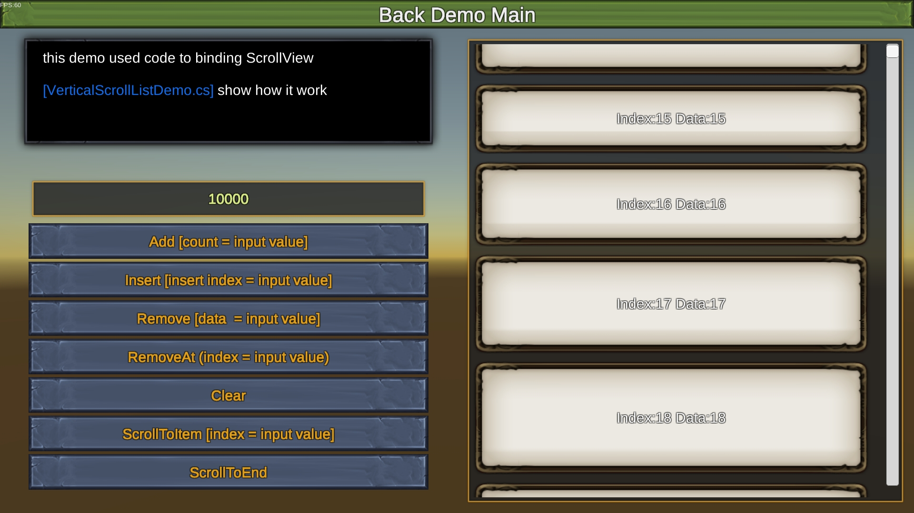
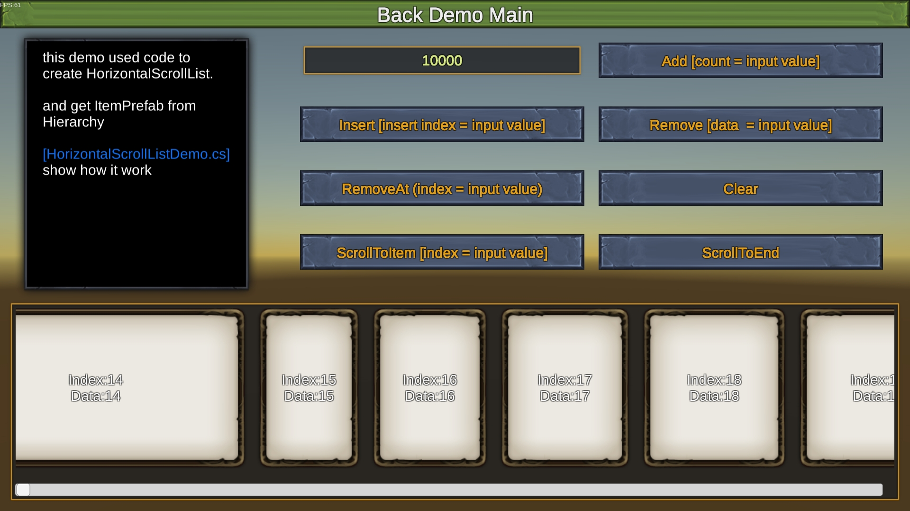
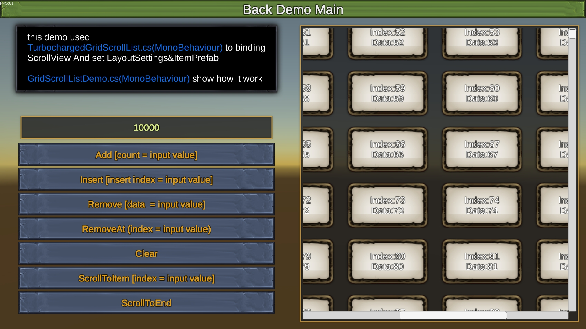

# TurbochargedScrollList

Version: 1.0

## 更新日志

2024-07-04
- 精简DEMO代码
- 增加列表项交互事件代码示例

## Demo

Android: [https://fir.xcxwo.com/ej34cba1](https://fir.xcxwo.com/ej34cba1)

## 简介

>我们在做UI时，会涉及到显示列表的展现，一个列表中可能会有很多的列表项。通常我们的解决方案，是使用UGUI的Scroll View，并且在Content上添加一个Layout Group组件来实现。但是UGUI并没有很好地优化列表项太多的问题，它的每一个列表项都是一个GameObject实体，存在于Hierarchy中，当我们的列表项过于复杂，或者过多时（假设1000个），程序将会卡顿的无法使用。

TurbochargedScrollList是对UGUI ScrollView的一个强化。它在保证简单易上手的前提下，很好地解决了以上引用内容提到的问题。通过TurbochargedScrollList加强过后的ScrollView，可以显示任意多个列表项。

## TurbochargedScrollList能做什么

1. 支持超大数据量的高效滚动列表（DEMO在晓龙660的安卓手机上，可以做到10000万个列表项快速滑动时稳定60FPS）
2. 支持列表项大小不一致

## 原理
TurbochargedScrollList的核心原理是基于对象池技术，让ScrollView变成一个虚拟列表，仅渲染Viewport中可以看到的几个内容。当然TurbochargedScrollList的渲染算法是特别优化过的，可以最大化的减少CPU和GPU的开销。另外Turbocharged的列表可以支持不同Size的列表项，这对很多虚拟列表开发者来说，是一个头疼的难题。

## 屏幕截图:

## 视频演示

>为了方便上手，对于每种制作流程，录制了视频来演示了操作

**B站:** [https://www.bilibili.com/video/av512602501](https://www.bilibili.com/video/av512602501)

## 代码介绍

[Assets/TurbochargedScrollList/ReadMe.md](Assets/TurbochargedScrollList/ReadMe.md)

